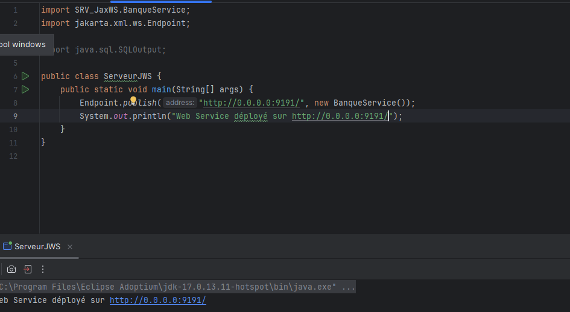

<h1>Web services SOAP WSDL</h1>

<h2>Description du dépôt GitHub:<h2>

<h3>Ce projet illustre une implémentation de service web basé sur SOAP en utilisant JAX-WS. Le service, nommé BanqueWS, propose les opérations suivantes :

getcompte : Récupérer les détails d'un compte spécifique.

Listcomptes : Obtenir la liste de tous les comptes.

Convert : Effectuer une conversion de devise.

Le fichier WSDL, généré par XML-WS Runtime (Metro JAX-WS), définit la structure et les opérations du service. Ce projet sert d'exemple pratique pour créer, exposer et consommer des services SOAP.</h3>

